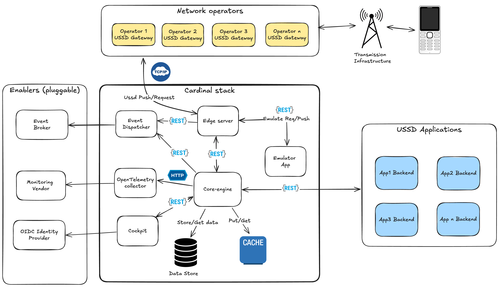

# What's cardinal stack?
**Cardinal-stack** is an opensource platform to build dynamic scalable USSD apps in any language with observability, testing and emulation figured out for you.

The aim of the **cardinal-stack** is to become the defato stack for USSD applications development.

# Vision
The **Cardinal-stack** was conceived to fullfill the needs of those that wish to build next generation USSD applications. The platform provides a rich feature set:

- Deploy new app versions without downtime
- Canary deployments out of the box
- Build USSD apps in any backend programming language
- Multi-tenancy - one platform instance to accommodate multiple teams
- Ability to handle continuous and growing user demand
- Blazing Fast user experience
- Ability to limit the amount of allowed USSD traffic  for each MNO (helpful to control costs and manage capacity)
- Vendor neutral Real-time Telemetry about the USSD Sessions and Transactions (by MNO)
- Test automation made easy - write tests that are MNO independent
- Future proof Architecture - easy to support for new  MNO, easy to change persistence technologies
- Privacy protection - customer session data is stored encrypted and sessions records deleted once session ends
- Take your application offline for selected operators
- Single API to trigger USSD push to all mobile networks (no more integration hassle)
- Whitelist users to test new functionalities easily
- Multiple independent application developers
- Assist customers the best way possible by seeing what they see.
- Allow teams to do maintenance in style.

# Architecture overview
**Cardinal-stack** is a platform that is deployed by WASPS (Wireless Applications Service Providers) to boost their USSD development. The platform is designed to seat between the USSD Gateway of the Mobile network operator and the USSD Applications. The platform defines an API contract that makes it easy for WASPs to handle USSD Interactions and to even initiate them (USSD Push) without being coupled to the Mobile Network operator USSD Gateway.

## Edge server
The **edge-server** is the entry and exit point of the **cardinal-stack** from the Mobile Network operators standpoint. The USSD Gateways of the Mobile Network Operators talk to the **edge-server** to deliver  incoming USSD Requests and they also receive USSD Push initiation requests from it. The edge-server is stateless, meaning that it doesn't store any state.

The **edge-server** uses an extensible design, having a plugin/extension for each Mobile Network operator, implementing the logic to receive requests from it and to initiate USSD sessions.

The **edge-server** sends Mobile Network incoming USSD traffic into the **core-engine**, but also exposes a **USSD Send API**, which is consumed by the **core-engine** to trigger USSD pushes. To enable simulation of USSD sessions the **core-engine** exposes a **Simulation API**. This last API allows teams to test the USSD Application logic without going through the Networking stack of a Mobile operator.

## Core-engine
The **core-engine** implements all the core concepts and logic of the Cardinal-stack (multi-tenancy, privacy protection, white listing). It's the component that communicates with upstream USSD applications. It defines the two API contracts that shape USSD applications:

* **USSD Requests API** - API to handle USSD Requests coming from end users. Implemented by USSD Applications and Consumed by the Core-engine itself.
* **USSD Push API**     - API to initiate USSD Push sessions, consumed by the USSD applications.

Apart from these two APIs, it also exposes meant for Administration and Operations:
* **Administration API** -  allows management and configuration of tenants, applications, whitelists and other objects defined and tracked by the engine.

* **Operations API** - provides capabilities to support troubleshooting and assistance to USSD sessiong going through the platform. The API allows amongst other operations: List active sessions, Stream session (Stream USSD content of a particular session), Inspect session data, alter session data, Manage short lists.

The **core-engine** implements caching and session persistence in a pluggable architecture, allowing implementation using different technologies aligned to preferences of whoever is deploying the stack.

The core-engine produces telemetry (Metrics and traces) to allow fine grained monitoring and troubleshooting.

## Emulator app
A Web application that emulates a USSD Dialling capable Mobile device and the GSM network that its connected to, enabling Developers and testers to explore/interact with USSD applications and experient with USSD pushes with a near realistic experience.

## Cockpit
Web application that basically consumes the **core-engine Admin API & Operations API** and makes it easy to carry out both administration and operations. The Cockpit employs Role Based Access control.
